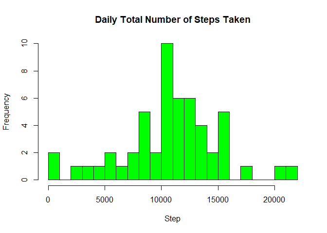
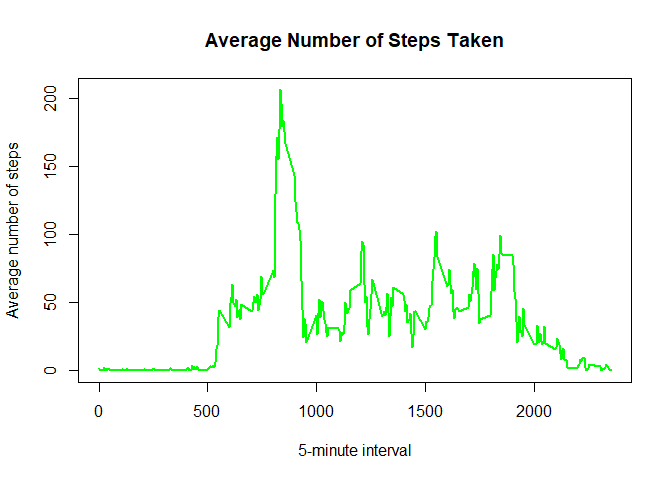
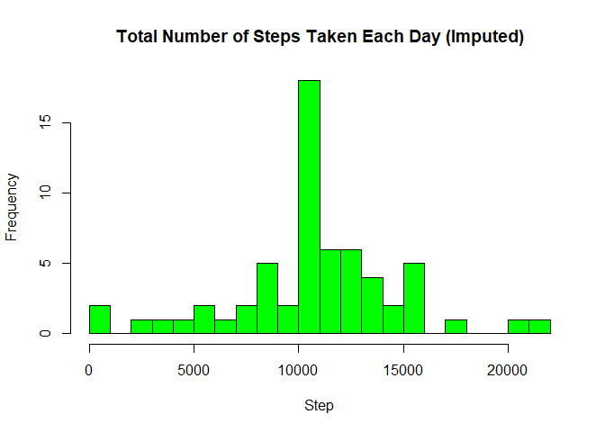
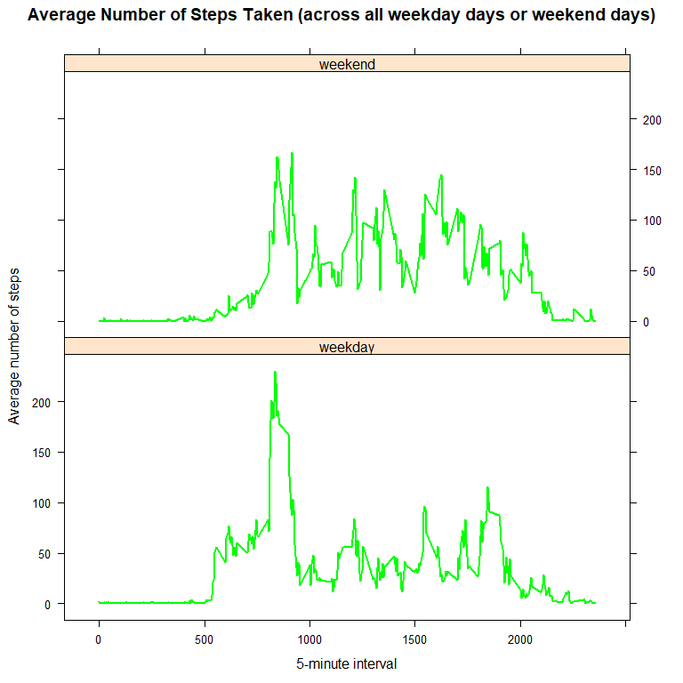

## Loading and preprocessing the data
Show any code that is needed to

1. **Load the data (i.e. `read.csv()`).**

```r
library(knitr)
```

```
## Warning: package 'knitr' was built under R version 3.5.3
```

```r
# Load the data
unzip("activity.zip")
activity <- read.csv("activity.csv")
# Check the data
head(activity)
```

```
##   steps       date interval
## 1    NA 2012-10-01        0
## 2    NA 2012-10-01        5
## 3    NA 2012-10-01       10
## 4    NA 2012-10-01       15
## 5    NA 2012-10-01       20
## 6    NA 2012-10-01       25
```

```r
str(activity)
```

```
## 'data.frame':	17568 obs. of  3 variables:
##  $ steps   : int  NA NA NA NA NA NA NA NA NA NA ...
##  $ date    : Factor w/ 61 levels "2012-10-01","2012-10-02",..: 1 1 1 1 1 1 1 1 1 1 ...
##  $ interval: int  0 5 10 15 20 25 30 35 40 45 ...
```

2. **Process/transform the data (if necessary) into a format suitable for your analysis.**

```r
# change class of the date variable from factor to date
activity$date <- as.Date(activity$date, format = "%Y-%m-%d")
```

## What is mean total number of steps taken per day?
For this part of the assignment, you can ignore the missing values in the dataset.

1. **Calculate the total number of steps taken per day.**

```r
total_step <- aggregate(steps ~ date, data = activity, sum, na.rm = TRUE)
head(total_step)
```

```
##         date steps
## 1 2012-10-02   126
## 2 2012-10-03 11352
## 3 2012-10-04 12116
## 4 2012-10-05 13294
## 5 2012-10-06 15420
## 6 2012-10-07 11015
```

2. **If you do not understand the difference between a histogram and a barplot, research the difference between them. Make a histogram of the total number of steps taken each day.**

```r
par(mfrow = c(1, 1))
hist(total_step$steps, breaks = 20, 
     main = "Daily Total Number of Steps Taken",
     col = "green", border = "black", xlab = "Step")
```

<!-- -->

3. **Calculate and report the mean and median of the total number of steps taken per day.**

```r
mean(total_step$steps)
```

```
## [1] 10766.19
```

```r
median(total_step$steps)
```

```
## [1] 10765
```

## What is the average daily activity pattern?
1. **Make a time series plot (i.e. `type = "l"`) of the 5-minute interval (x-axis) and the average number of steps taken, averaged across all days (y-axis).**

```r
avg_step <- aggregate(steps ~ interval, data = activity, mean, na.rm = TRUE)
plot(avg_step$interval, avg_step$steps, type = "l", lwd = 2, col = "green",
     main = "Average Number of Steps Taken", 
     xlab = "5-minute interval", ylab = "Average number of steps")
```

<!-- -->

2. **Which 5-minute interval, on average across all the days in the dataset, contains the maximum number of steps?**

```r
avg_step$interval[which.max(avg_step$steps)]
```

```
## [1] 835
```
The 835-th 5-minute interval contains the maximum number of steps.


## Imputing missing values
Note that there are a number of days/intervals where there are missing values (coded as `NA`). The presence of missing days may introduce bias into some calculations or summaries of the data.

1. **Calculate and report the total number of missing values in the dataset (i.e. the total number of rows with `NA`s).**

```r
sum(is.na(activity))
```

```
## [1] 2304
```
There are 2304 total missing values in the dataset.

2. **Devise a strategy for filling in all of the missing values in the dataset. The strategy does not need to be sophisticated. For example, you could use the mean/median for that day, or the mean for that 5-minute interval, etc.**

I use the mean of 5-minute interval to fill in the values of the missing values.

3. **Create a new dataset that is equal to the original dataset but with the missing data filled in.**

```r
activity2 <- activity # let's call the new dataset "activity2"
for (i in avg_step$interval) {
    activity2[activity2$interval == i & is.na(activity2$steps), ]$steps <- 
        avg_step$steps[avg_step$interval == i]
}
head(activity2) # no NAs
```

```
##       steps       date interval
## 1 1.7169811 2012-10-01        0
## 2 0.3396226 2012-10-01        5
## 3 0.1320755 2012-10-01       10
## 4 0.1509434 2012-10-01       15
## 5 0.0754717 2012-10-01       20
## 6 2.0943396 2012-10-01       25
```

```r
sum(is.na(activity2)) # should be evaluated equal to 0
```

```
## [1] 0
```


4. **Make a histogram of the total number of steps taken each day and Calculate and report the mean and median total number of steps taken per day. Do these values differ from the estimates from the first part of the assignment? What is the impact of imputing missing data on the estimates of the total daily number of steps?**

```r
total_step_activity2 <- aggregate(steps ~ date, data = activity2, sum, na.rm = TRUE)
hist(total_step_activity2$steps, breaks = 20, 
     main = "Total Number of Steps Taken Each Day (Imputed)",
     col = "green", border = "black", xlab = "Step")
```

<!-- -->

```r
mean(total_step_activity2$steps)
```

```
## [1] 10766.19
```

```r
median(total_step_activity2$steps)
```

```
## [1] 10766.19
```
The new mean is the same as the initial, but the median changed a bit. Since the imputed values are means, the result have small variation on the distribution. The median value became closer to the means since the imputed values are mean values.

# Are there differences in activity patterns between weekdays and weekends?

For this part the `weekdays()` function may be of some help here. Use the dataset with the filled-in missing values for this part.

1. **Create a new factor variable in the dataset with two levels - "weekday" and "weekend" indicating whether a given date is a weekday or weekend day.**

```r
activity2$day <- weekdays(activity2$date)
activity2$week <- ""
activity2[activity2$day == "Saturday" | activity2$day == "Sunday", ]$week <- "weekend"
activity2[!(activity2$day == "Saturday" | activity2$day == "Sunday"), ]$week <- "weekday"
activity2$week <- factor(activity2$week)
```

2. **Make a panel plot containing a time series plot (i.e. `type = "l"`) of the 5-minute interval (x-axis) and the average number of steps taken, averaged across all weekday days or weekend days (y-axis). See the README file in the GitHub repository to see an example of what this plot should look like using simulated data.**

```r
avg_step_activity2 <- aggregate(steps ~ interval + week, data = activity2, mean)
library(lattice)
xyplot(steps ~ interval | week, data = avg_step_activity2, type = "l", lwd = 2,
       layout = c(1, 2), col = "green",
       xlab = "5-minute interval", 
       ylab = "Average number of steps",
       main = "Average Number of Steps Taken (across all weekday days or weekend days)")
```

<!-- -->
